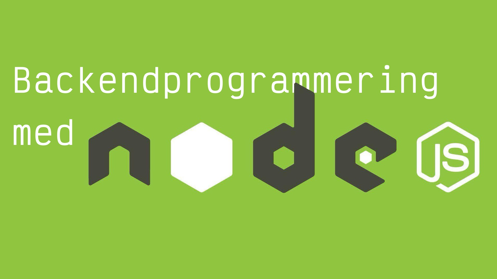

 <!-- _color: #fff -->

 
         

# Föreläsning 1

---

 
 
 
 

# Incheck

---

#### Backendprogrammering med Node JS

#### Lärare: Viktor Lyresten (Maskinrepubliken)

_Jag pratar gärna om..._

- Systemarkitektur
- FOSS & Open Source
- Utveckling som hantverk
- Javascript
- Film, kultur och sådant skojigt
- Allt som går att vrida och vända på...

---

#### Backendprogrammering med Node JS

#### Eleven: du och ni (Frontendutvecklare '23)

_Varm i kläderna, nått viss nivå_:

- Kan **JavaScript**, HTML & CSS
- Kan använda `git` & Github
- Kan strukturera och dokumentera kod
- Kan använda och **anropa** API:er
- Kan använda byggsystem och preprocessorer.
- Använder **TypeScript**

---

#### Backendprogrammering med Node JS

#### Eleven: du och ni (Frontendutvecklare '23)

_Fortsatt kunskapsincheck..._

- Kan hitta, installera och använda **ramverk** och **bibliotek**
- Kan planera och genomföra projekt
- Kan använda React och dess **ekosystem**.
- _Kunna organisera och skapa paketering för levernas_

---

#### Backendprogrammering med Node JS

#### Eleven: du och ni (Frontendutvecklare '23)

_Fortsatt kunskapsincheck..._

- Relationsdatabaser
- Språket **SQL** och dess funktioner
- **NoSQL-databaser**

_Vad mer?_
_Frågor?_

---

 
 
 
 

# Om kursen

---

#### Kursens syfte

Kursen syftar till att de studerande skaffar sig kunskaper och färdigheter om **backend**-programmering med Node. Den bygger vidare på tidigare kurser om databashantering och ramverket React.

Kursen lär ut hur man bygger ett **API** och kommunicerar via **API som gränssnitt** mellan olika applikationer, system eller olika miljöer.

---

#### Kursens mål

###### _kunskap_

  

1. Kommunikation via API.

---

#### Kursens mål

###### _kunskap_

  

2. Att konfigurera en Node.js-server för att köra JavaScript i olika operativsystem samt vilka konsekvenser valet av server har för en applikation samt översikt över pakethantering.

---

#### Kursens mål

###### _kunskap_

  

3. En grundläggande förståelse för ekosystemet kring backend för den moderna webben. Känna till begrepp som exempelvis webbshop, open source, CMS, headless, REST, m.fl.

---

#### Kursens mål

###### _färdighet_

  

4. Utföra installationer av en Node.js-instans som möjliggör att JavaScript körs på server och lägga till utvalda tilläggspaket.

---

#### Kursens mål

###### _kompetens_

  

5. Självständigt utveckla Node.js-applikationer och använda tillhörande pakethantering.

---

#### Kursens mål

###### _kompetens_

  

6. Förståelse hur applikationens ansvarsområden sker i exempelvis backend, API, tekniska stacken och ramverket React.

---

#### Kursens moment

**Föreläsningar 6h x 2d x 4v**
Vi börjar veckorna med föreläsningar _måndagar_ och _tisdagar_ och går igenom ny teori samt gör övningar tillsammans. kl. 9-16.

**Handledningar 3h x 2d**
Under veckan har vi gemensam handledning och övningstid på _onsdagar_ och _fredagar_. Mellan kl 9 och 12. _undantaget 6:e november_

**Självstudietiden 22h x 4v**
Under er självstudietid förväntas ni läsa på samt genomföra utdelade inlämningsuppgifter.

---

#### Platser

**Google Meet**
https://meet.google.com/yha-wmsh-you

**Plugga Tech**
[plugga.tech/grupp/yrkeshogskolan-i-boras-frontendutvecklare](https://plugga.tech/grupp/yrkeshogskolan-i-boras-frontendutvecklare)

---

 
 
 
 

## Inlämningsuppgifter

---

### Större gruppuppgift

- **Betyg:** IG/G
- **Försök:** 2 försök (1 omexamination.)
- **Kursmål:** 1, 2, 3, 4
- **Betygsättning**: IG/G/VG

Skapa ett Web API med stöd för flera olika användare och kopplat till ett React gränssnitt.

---

### Individuell inlämningsuppgift

- **Betyg:** IG/G/VG
- **Försök:** 3 försök (2 omexamination.)
- **Kursmål:** 5, 6
- **Betygsättning:** IG/G

_För betyget Väl Godkänt ska den studerande ha fördjupade kunskaper att utveckla Node.js-applikationer och använda tillhörande pakethantering via API samt ha fördjupade kunskaper om backend-programmering med Node.js._

---

 
 
 
 

## Den här veckan...

---

### Den här veckan...

**Introduktion till Node.js**
Vad är Node.js? Översikt över ekosystemet. Varför använda det?

**Installera och konfigurera Node.js**
Hur man sätter upp en server för att köra JavaScript. Fokusera på olika operativsystem, inklusive skillnader och konsekvenser.

**Grundläggande API-kommunikation**
RESTful API, HTTP-metoder (GET, POST, PUT, DELETE). Bygga enkla API med Express.js.
